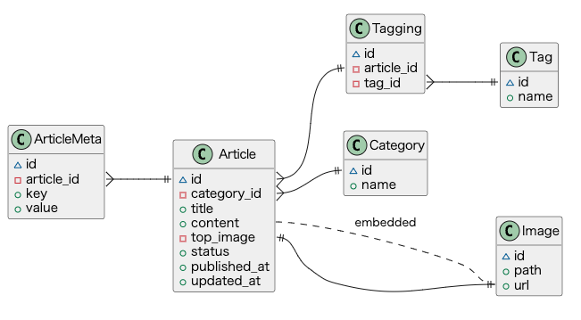
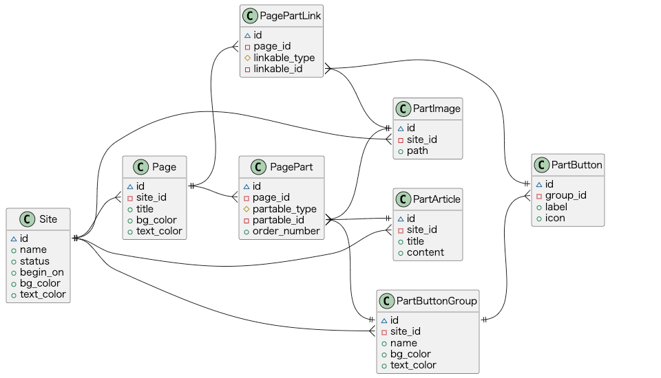
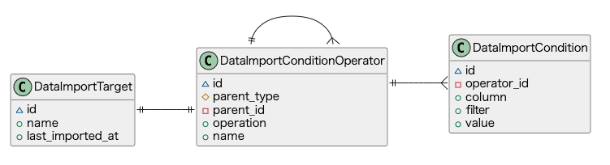
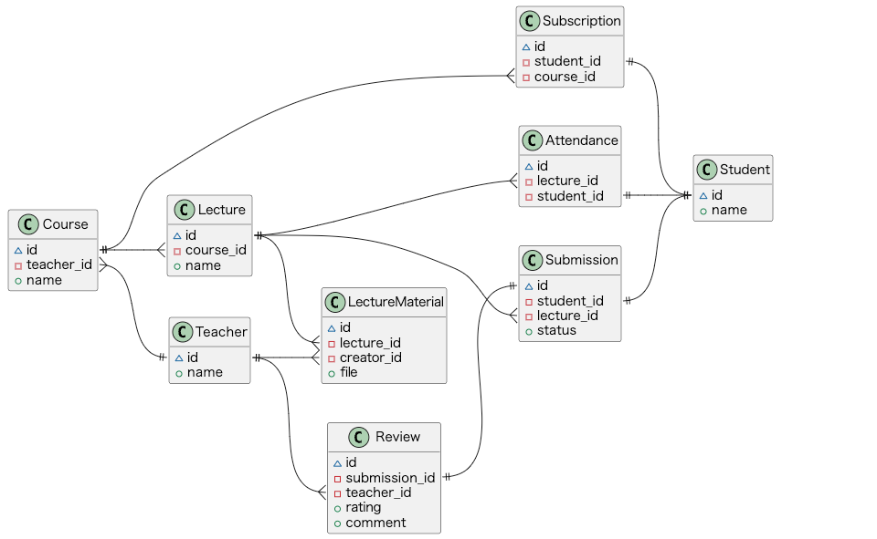
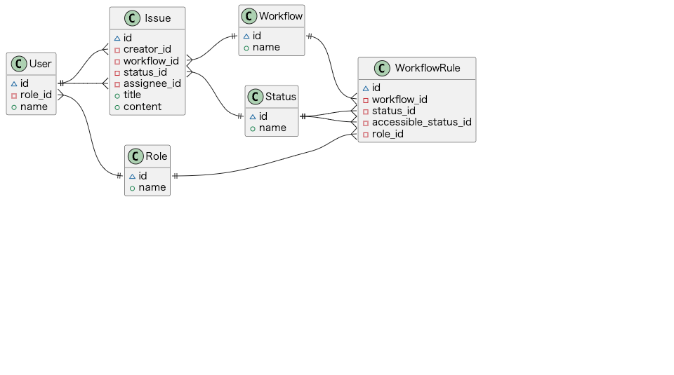
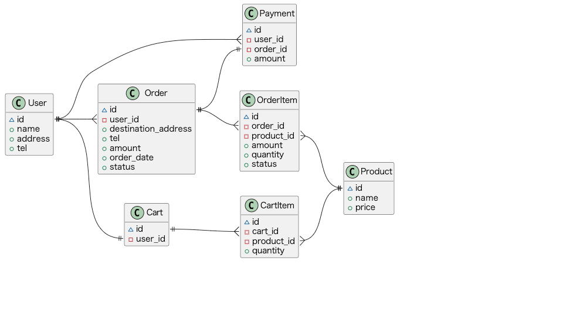

# database-modeling-patterns
Database modeling patterns

## Blog
[[View Notebook](Blog.ipynb)]

## CMS
[[View Notebook](CMS.ipynb)]

## DataImportFilter
[[View Notebook](DataImportFilter.ipynb)]

## e-Learning
[[View Notebook](e-Learning.ipynb)]

## IssueWorkflow
[[View Notebook](IssueWorkflow.ipynb)]

## Shopping
[[View Notebook](Shopping.ipynb)]

## SpreadsheetFormatter
[[View Notebook](SpreadsheetFormatter.ipynb)]

