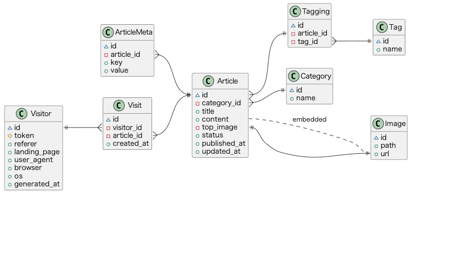

# database-modeling-patterns
Database modeling patterns

* [Blog](#Blog)
* [CMS](#CMS)
* [DataImportFilter](#DataImportFilter)
* [e-Learning](#e-Learning)
* [IssueWorkflow](#IssueWorkflow)
* [Shopping](#Shopping)
* [SpreadsheetFormatter](#SpreadsheetFormatter)

## Blog
[[View Notebook](Blog/Blog.ipynb)]

## CMS
[[View Notebook](CMS/CMS.ipynb)]

## DataImportFilter
[[View Notebook](DataImportFilter/DataImportFilter.ipynb)]

## e-Learning
[[View Notebook](e-Learning/e-Learning.ipynb)]

## IssueWorkflow
[[View Notebook](IssueWorkflow/IssueWorkflow.ipynb)]

## Shopping
[[View Notebook](Shopping/Shopping.ipynb)]

## SpreadsheetFormatter
[[View Notebook](SpreadsheetFormatter/SpreadsheetFormatter.ipynb)]

